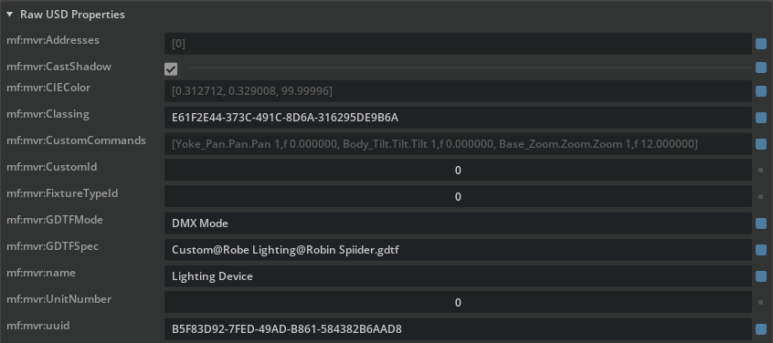

# MF.OV.MVR and MF.OV.GDTF

Brings support of MVR and GDTF files to Omniverse and USD.
This repository contains two different extensions.

GDTF (General Device Type Format) defines an asset format that collects technical information about Audiovisual devices. It is currently centered on lighting fixtures and provide accurate digital twins of lighting devices from 100+ manufacturers.

MVR (My Virtual Rig) is a scene format that can describe an complete rig of lights, using GDTF assets at its core while adding capabilities to define groups, layers, DMX address and more to allow lighting designer to build virtual replicas of their lighting rigs and enforce a single file format from show design to previz to operation.

This repository contains two separate extensions :

- [MVR extension](./exts/mf.ov.mvr/)
- [GDTF extension](./exts/mf.ov.gdtf/)


# Requirements

- Requires Omniverse Kit >= 105
- Tested in USD Composer 2023.2.2 and 2023.2.0

# Build

## Build for Omniverse

- Just run `build.bat`
- Once the build is complete, the FileFormat dlls should be located under : `_install/windows-x86_64/release`

## Build for USDView

The dependency configuration is contained in the [usd-deps.packman.xml](deps/usd-deps.packman.xml) file
To switch to the correct OpenUSD version for USDview compilation, it may be required to edit the packman configuration file to : 

```
<project toolsVersion="5.6">
  <dependency name="nv-usd" linkPath="../_build/usd-deps/nv-usd/${config}">
    <package name="usd.py310.${platform}.usdview.${config}" version="0.23.05-tc.47+v23.05.b53573ea" />
  </dependency>
  <dependency name="python" linkPath="../_build/usd-deps/python">
    <package name="python" version="3.10.13+nv1-${platform}" />
  </dependency>
</project>
```

`source setenvwindows`

Test with `usdview resources/scene.usda`

Note : light meshes will not show up unless you have a GLTF FileFormat plugin enabled.

## Alternate builds 

At the bottom of this Readme, you will find alternative ways of building for Unreal 5.3 and Blender 4.0.

# Using the extension

To enable the extensions in USD Composer:
-  `Window` > `Extensions`
-  Search for `MF GDTF Converter` or `MF MVR Converter` in commuunity and enable them with the "autoload" checkbox.
-  Restart USD composer. 

## Sample files

MVR samples : 
- [7-fixtures-samples.mvr](./exts/mf.ov.mvr/sample/7-fixtures-sample.mvr/)
- [fixture-line-gltf.mvr](./exts/mf.ov.mvr/sample/fixture-line-gltf.mvr/)
 
GDTF sample 
- [Robin_MMX_Blade](./exts/mf.ov.gdtf/sample/Robe_Lighting@Robin_MMX_Blade@2023-07-25__Beam_revision.gdtf)

Thousands of GDTF files are available on [GDTF-share](https://gdtf-share.com/). 

For example the very last version of the GDTF sample file we provide can be downloaded from [here](https://gdtf-share.com/share.php?page=home&manu.=Robe%20Lighting&fix=Robin%20MMX%20Blade)


## Reference MVR/GDTF files

To reference an MVR or a GDTF file, just drag and drop the file on your viewport or your Stage Window.

## Convert MVR/GDTF files

Note: to properly work with MVR files, both extension have to be enabled.

1. In the content tab, browse to the folder where you want to import your `MVR` or `GDTF` files.
2. Click the `+Import` button and select "External Assets (FBX, OBJ...)
3. Choose a `MVR` or `GDTF` file and wait for it to import.
   -  MVR import
      - The import result will be stored in a folder with the same name as the imported file in the current content browser directory.
      - If `GDTF` files are referenced, they will be converted to `USD` in a subfolder.
   - GDTF import
      - The import result will be stored in a folder with the same name as the imported file in the current content browser directory.
4. To finalize the import, drag the freshly converted `USD` file in your project or open it.

# Implementation notes

## `MVR.USD` USD schema

Note : not every aspect of the MVR specification is currently implemented for USD, as we focused on the ability to retrieve the lighting fixture information.

1. Under the Root, you'll find `Scope` representing the different `Layers` of the MVR scene.
2. Inside them you'll find each GDTF Fixture represented by an `Xform` pointing to an USD payload.
3. `Xform` are named using their names and their uuid to ensure unique naming.
4.  `Xform` also have custom properties (see Raw USD Properties) using the following convention: `mf:mvr:property`.


```
Root/
└─📁MVR-Layer1 (Scope)
|  ├─💠Make_Model_UID1 (Xform with payload)
|  └─💠Make_Model_UID2 (Xform with payload)
└──📁MVR-Layer1 (Scope)
   └─💠Make_Model_UID1 (Xform with payload)
   └─💠Make_Model_UID2 (Xform with payload)
```

## MVR Raw USD Properties

When importing an MVR files, some properties specific to MVR and not compatible with USD will be imported as raw USD properties of an Xform holding a lighting fixture :

| Property               | Type                                                                                               |    Description                                                                           |
|---                     |---                                                                                                 |---                                                                                       |
|`mf:mvr:name`           |[🔗String](https://github.com/mvrdevelopment/spec/blob/main/mvr-spec.md#generic-value-types)        | The name of the object.                                                                 |
|`mf:mvr:uuid`           |[🔗UUID](https://github.com/mvrdevelopment/spec/blob/main/mvr-spec.md#generic-value-types)          | The unique identifier of the object.                                                    |
|`mf:mvr:Classing`       |[🔗UUID](https://github.com/mvrdevelopment/spec/blob/main/mvr-spec.md#generic-value-types)          | The class the object belongs to                                                         |
|`mf:mvr:GDTFMode`       |[🔗String](https://github.com/mvrdevelopment/spec/blob/main/mvr-spec.md#generic-value-types)        | The name of the used DMX mode. This has to match the name of a DMXMode in the GDTF file.|
|`mf:mvr:GDTFSpec`       |[🔗FileName](https://github.com/mvrdevelopment/spec/blob/main/mvr-spec.md#generic-value-types)      | The name of the file containing the GDTF information for this light fixture.            |
|`mf:mvr:CastShadow`     |[🔗Bool](https://github.com/mvrdevelopment/spec/blob/main/mvr-spec.md#generic-value-types)          | Wether the fixture casts shadows or not.                                                |
|`mf:mvr:UnitNumber`     |[🔗Integer](https://github.com/mvrdevelopment/spec/blob/main/mvr-spec.md#generic-value-types)       |The unit number of the lighting fixture in a position.                                   |
|`mf:mvr:Addresses`      |[🔗Adresses](https://github.com/mvrdevelopment/spec/blob/main/mvr-spec.md#node-definition-addresses)| the DMX  address of the fixture.                                                        |
|`mf:mvr:CustomCommands` |[🔗CustomCommands](https://github.com/mvrdevelopment/spec/blob/main/mvr-spec.md#node-definition-customcommands)|  Custom commands that should be executed on the fixture                      |
|`mf:mvr:CIEColor`       |[🔗CIE Color](https://github.com/mvrdevelopment/spec/blob/main/mvr-spec.md#user-content-attrtype-ciecolor)| A color assigned to a fixture. If it is not defined, there is no color for the fixture.|
|`mf:mvr:FixtureTypeId`  |[🔗Integer](https://github.com/mvrdevelopment/spec/blob/main/mvr-spec.md#generic-value-types)       | The Fixture Type ID is a value that can be used as a short name of the Fixture Type.    |
|`mf:mvr:CustomId`       |[🔗Integer](https://github.com/mvrdevelopment/spec/blob/main/mvr-spec.md#generic-value-types)       |The Custom ID is a value that can be used as a short name of the Fixture Instance.       |

Example




## `GDTF.USD` USD Schema

GDTF can have multiple structure type, but here is a typical example for a moving light.

```
Root/
└─💠 Base (Xform)
   ├─💠model (Xform)
   │  └─🧊 mesh (Mesh)
   ├─💠Yoke (Xform)
   │  ├─💠model (Xform)
   │  │  └─🧊 mesh (Mesh)
   |  └──💠Head (Xform)
   │      └─💠model (Xform)
   │         └─🧊 mesh (Mesh)
   └─📁Looks (Scope)
```

## GDTF Raw USD Properties

### Properties affecting the USD Prims properties
| Property                    | Type                                                                                                       | Description
|---                          |---                                                                                                         |---
|`mf:gdtf:BeamAngle`          |[🔗Float](https://github.com/mvrdevelopment/spec/blob/main/gdtf-spec.md#table-1--xml-attribute-value-types)| Will affect the USD Light's `Cone Angle`.
|`mf:gdtf:ColorTemperature`   |[🔗Float](https://github.com/mvrdevelopment/spec/blob/main/gdtf-spec.md#table-1--xml-attribute-value-types)| Color temperature; Unit: kelvin. Will affec USD Light's `Color Temperature`.  
|`mf:gdtf:LuminousFlux`       |[🔗Float](https://github.com/mvrdevelopment/spec/blob/main/gdtf-spec.md#table-1--xml-attribute-value-types)| Intensity of all the represented light emitters; Unit: lumen. Will affec USD Light's `intensity`

### Fixture
| Property                          | Type                                                                                                         | Description
|---                                |---                                                                                                           |---
|`mf:gdtf:OperatingTemperature:High`|[🔗Float](https://github.com/mvrdevelopment/spec/blob/main/gdtf-spec.md#table-1--xml-attribute-value-types)  | Lowest temperature the device can be operated. Unit: °C.
|`mf:gdtf:OperatingTemperature:Low` |[🔗Float](https://github.com/mvrdevelopment/spec/blob/main/gdtf-spec.md#table-1--xml-attribute-value-types)  | Highest temperature the device can be operated. Unit: °C.
|`mf:gdtf:Weight`                   |[🔗Float](https://github.com/mvrdevelopment/spec/blob/main/gdtf-spec.md#table-1--xml-attribute-value-types)  | Weight of the device including all accessories. Unit: kilogram.
|`mf:gdtf:LegHeight`                |[🔗Float](https://github.com/mvrdevelopment/spec/blob/main/gdtf-spec.md#table-1--xml-attribute-value-types)  | Defines height of the legs - distance between the floor and the bottom base plate. Unit: meter.

### Beam (Light)
| Property                    | Type                                                                                                       | Description
|---                          |---                                                                                                         |---
|`mf:gdtf:BeamType`           |[🔗Enum](https://github.com/mvrdevelopment/spec/blob/main/gdtf-spec.md#table-1--xml-attribute-value-types) | Beam Type; Specified values: "Wash", "Spot", "None", "Rectangle", "PC", "Fresnel", "Glow".
|`mf:gdtf:ColorRenderingIndex`|[🔗Uint](https://github.com/mvrdevelopment/spec/blob/main/gdtf-spec.md#table-1--xml-attribute-value-types) | The CRI according to TM-30 is a quantitative measure of the ability of the light source showing the object color naturally as it does as daylight reference.
|`mf:gdtf:FieldAngle`         |[🔗Float](https://github.com/mvrdevelopment/spec/blob/main/gdtf-spec.md#table-1--xml-attribute-value-types)| Field angle; Unit: degree.
|`mf:gdtf:LampType`           |[🔗Enum](https://github.com/mvrdevelopment/spec/blob/main/gdtf-spec.md#table-1--xml-attribute-value-types) | Defines type of the light source; The currently defined types are: Discharge, Tungsten, Halogen, LED.
|`mf:gdtf:PowerConsumption`   |[🔗Float](https://github.com/mvrdevelopment/spec/blob/main/gdtf-spec.md#table-1--xml-attribute-value-types)| ower consumption; Unit: Watt.

### XML Notes

Example of a fixture defined in a MVR file (contains some, but not all properties):
```xml
<Fixture name="Sharpy" uuid="C63B1F8D-6DAD-438C-9228-E33C6EF2947E">
    <Matrix>{-1.000000,0.000000,0.000000}{0.000000,-1.000000,-0.000000}{0.000000,0.000000,1.000000}{-766.333333,4572.000000,7620.000000}</Matrix>
    <GDTFSpec>Clay Paky@Sharpy [Bulb=MSD Platinum 5R 189W].gdtf</GDTFSpec>
    <GDTFMode>Vect</GDTFMode>
    <Addresses>
        <Address break="0">21</Address>
    </Addresses>
    <FixtureID>102</FixtureID>
    <UnitNumber>0</UnitNumber>
    <FixtureTypeId>0</FixtureTypeId>
    <CustomId>0</CustomId>
    <Color>0.312712,0.329008,100.000000</Color>
    <CastShadow>false</CastShadow>
    <Mappings/>
</Fixture>
```

Some notes on the properties:
- Matrix is in millimeters (applies to the last part, the translation).
- Color is in [CIE 1931 color space](https://en.wikipedia.org/wiki/CIE_1931_color_space) and represent the color of a color gel or similar apparatus and not of the fixture itself.

# Alternate builds

## Build for Unreal 5.3

Unreal 5.3 uses USD 23.02
Use the following dependency
```
<dependency name="nv-usd" linkPath="../_build/usd-deps/nv-usd/${config}">
    <package name="usd.py310.${platform}.usdview.${config}" version="0.23.02-tc.1+pxr-23.02-build-patch.9ed269df" />
  </dependency>
```
- In your Unreal project, enable the USD Importer plugin
- Create a subfolder in your Unreal Project ex : `MyProject/Content/USDPlugins`
- Copy the plugInfo.json and the mvrFileFormat.dll at the root of this folder
- Adapt the plugInfo.json :
  - `"LibraryPath": "mvrFileFormat.dll"`
  - `"ResourcePath": "."`,
  - `"Root": "."`
- Add the `MyProject/Content/USDPlugins` in Edit > Project Settings > USDImporter > Additional Plugin Directories

Note.  
Unreal is gonna complain about missing dll.
Dirty fix is to add the following dll (take the one from packman) into the `...UE_5.3\Engine\Binaries\Win64`
- `boost_python310-vc142-mt-x64-1_78.dll`
- `python310.dll`

## Build for Blender 3.6.x or 4.0

Waiting for a cleaner way to provide build support for Blender, here is a step by step. 
Use the following dependency.

```
<dependency name="blender_usd" linkPath="../_build/usd-deps/nv-usd">
    <package name="blender_usd" version="63380-py310-usd23.05-windows-x86_64"/>
  </dependency>
```
In the `repo.toml`
Modify the USD dependencies.
```
usd_lib_dependencies = [
    "ms"
]
```

Remove `%{config}` after `usd_root`

```
usd_root = "${root}/_build/usd-deps/nv-usd"
```

Copy the Plugin folder : `omniverse-mvr-extension/_install/windows-x86_64/release/mvrFileFormat` 

into your Blender Plugin folder `BLENDER_ROOT/blender.shared/usd`

# Resources

- Inspired by : [NVIDIA's usd-plugin-sample](https://github.com/NVIDIA-Omniverse/usd-plugin-samples/)
- [MVR and GDTF homepage with Fixture Library](https://gdtf-share.com/)
- [Specifications Github repostory](https://github.com/mvrdevelopment/spec)
- [Gdtf.eu](https://gdtf.eu/docs/list-of-projects/)

# Known limitation

- GDTF files using 3ds model are supported but will require python 3.10 cli installed on the host computer. 
- Some MVR or GDTF files might fail to convert due to invalid or incomplete files.
- Only lighting devices are supported, prefer for importing mvr file not contaning trusses for instance. It could lead to strange behaviors and crashes.